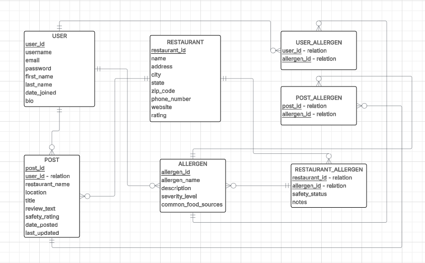
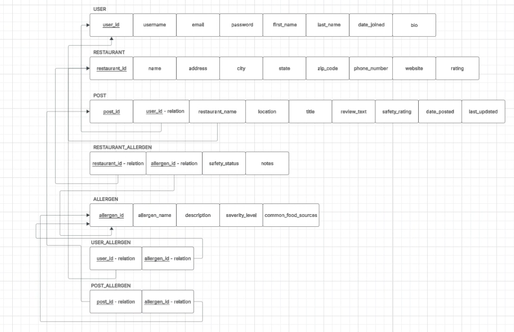

## FullStackProjectWDP2026

The purpose of my project SafeEats is to create a website where users with different diseases, allergies, or dietary restrictions can discover, 
discuss, and post about restaurants that are safe for them to eat at.

## ERD and Business rules

Below is the ERD diagram I created to represent my database for the SafeEats website visually:

Below are my business rules for each table:

For USER - POST: A USER may create zero or many POSTS. A POST must be created by exactly one USER.

For USER - ALLERGEN (via USER_ALLERGEN): A USER may have zero or many ALLERGENS. An ALLERGEN may be associated with zero or many USERS.

For USER_ALLERGEN - USER: Each USER_ALLERGEN record must be associated with exactly one USER. A USER may have zero or many USER_ALLERGEN records.

For USER_ALLERGEN - ALLERGEN: Each USER_ALLERGEN record must be associated with exactly one ALLERGEN. An ALLERGEN may appear in zero or many USER_ALLERGEN records.

For POST - ALLERGEN (via POST_ALLERGEN): A POST may have zero or many ALLERGENS. An ALLERGEN may be associated with zero or many POSTS.

For POST_ALLERGEN - POST: Each POST_ALLERGEN record must be associated with exactly one POST. A POST may have zero or many POST_ALLERGEN records.

For POST_ALLERGEN - ALLERGEN: Each POST_ALLERGEN record must be associated with exactly one ALLERGEN. An ALLERGEN may appear in zero or many POST_ALLERGEN records.

For RESTAURANT - ALLERGEN (via RESTAURANT_ALLERGEN): A RESTAURANT may have zero or many ALLERGENS. An ALLERGEN may be associated with zero or many RESTAURANTS.

For RESTAURANT_ALLERGEN - RESTAURANT: Each RESTAURANT_ALLERGEN record must be associated with exactly one RESTAURANT. A RESTAURANT may have zero or many RESTAURANT_ALLERGEN records.

For RESTAURANT_ALLERGEN - ALLERGEN: Each RESTAURANT_ALLERGEN record must be associated with exactly one ALLERGEN. An ALLERGEN may appear in zero or many RESTAURANT_ALLERGEN records.

## Relations

The Relations diagram below shows the specific relationships between the tables in the SafeEats database. It helps visualize how users, posts, restaurants, and allergens are connected through the different relationship tables in the system.

